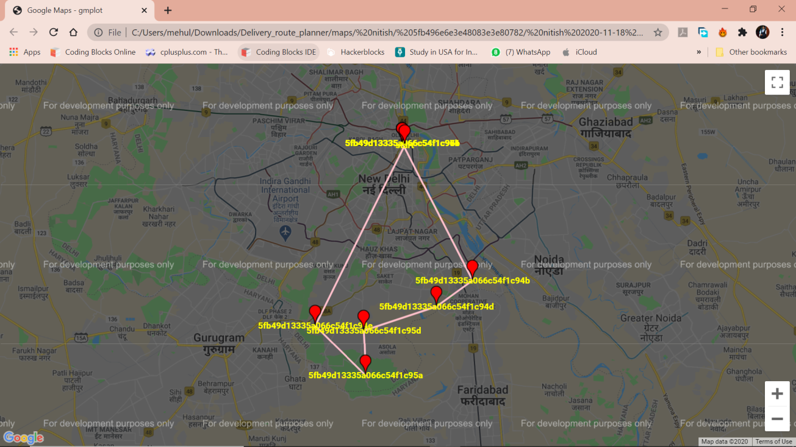

# **Delivery Route Planner** 
 
A software to plane the delivery route
</br>


## Table of Contents
- [**Delivery Route Planner**](#delivery-route-planner)
  - [Table of Contents](#table-of-contents)
  - [Details](#details)
  - [About](#about)
  - [Screenshots](#screenshots)
  - [Installation Prerequisites](#installation-prerequisites)
  - [How to Run this Project](#how-to-run-this-project)
  - [Contributors](#contributors)


## Details
[Click Here to Download Report File (OOPS LAB)](https://drive.google.com/file/d/13SQmRpAxv2kEHV5uPzRcYT0GgUYkXrKC/view?usp=sharing) \
[Click Here to Download Report File (DST)](https://drive.google.com/file/d/1aMgzktlz6SwwaAeuxjjie9NoRkyNi4cP/view?usp=sharing) \
[Click Here to See the Presentation](https://drive.google.com/file/d/1ILHy37teAyrGNYbV09gsiXmfZxjpdPTP/view?usp=sharing)


## About
This project deals with the ‘Efficient Delivery: Route Planner’. The software is basically user specific and built for the manager of a corporation to have a look through the work in progress, maintaining the employees’ details, maintaining the order details and how are they being processed at what stage.
This Project has the following functionalities :

</br>
</br>

## Screenshots

1. Registration Window.

    
    <br>

2. Login Window

    
    <br>

3. Routes Sample.

    
    <br>

</br>


## Installation Prerequisites
- python
>To Download python  [Go to the python Download Website](https://www.python.org/downloads/).

- Mongodb
> To install Mongodb [Go to this Link](https://docs.mongodb.com/manual/administration/install-community/)

- SQL
> To install MySQL [Go to this Link](https://dev.mysql.com/downloads/installer/)


---

## How to Run this Project
1. Clone this Repo to your Local Machine.
2. Open The Terminal/CMD in the folder Delivery_route_planner.
3. Type ```py -m pip install -r requirements.txt' ```to install all the required libraries.
4. Type ```mongod``` in your Terminal to Run mongodb Server (Ignore if already Running).

## Contributors
[Nitish Kumar](https://github.com/Nitish9711)

[Mehul Jain](https://github.com/Nitish9711)

