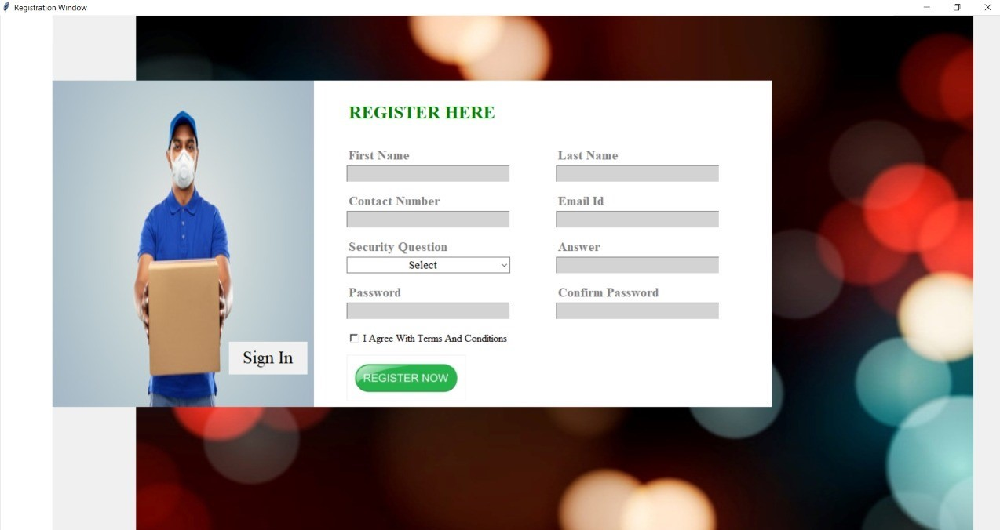
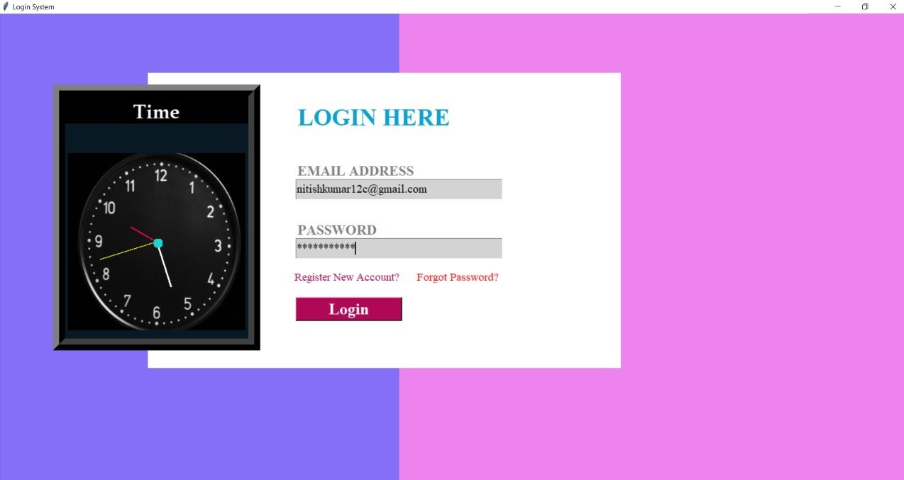
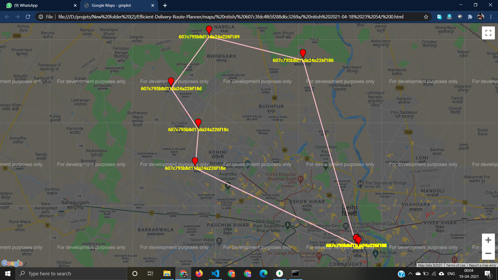

# Efficient delivery route planner

 

## Table of Contents

- [Table of Contents](#table-of-contents)
- [demo](#demo)
- [About](#about)
- [Screenshots](#screenshots)
- [Installation Prerequisites](#installation-prerequisites)
- [How to Run this Project](#how-to-run-this-project)
- [Contributors](#contributors)

## demo

[Click Here to See the PPT](https://drive.google.com/file/d/1uk57w8jLLdFR8R_OlYDj4onyYjFqwTue/view?usp=sharing)  
[Click Here to See the Report](https://drive.google.com/file/d/1f_-7-VAplfq5CyBZSlPU6eVeB97GwMSq/view?usp=sharing)

## About

This project deals with the ‘Efficient Delivery: Route Planner’. The software is basically user specific and built for the manager of a corporation to have a look through the work in progress, maintaining the employees’ details, maintaining the order details and how are they being processed at what stage.

In the previous system everything had to be processed manually which at times becomes very hectic for the chief management. All the work had to be fed manually and processed manually without the assurance of authenticity and efficiency of the working/processing.

Now we have built a platform/software where in the chief managing person has the powers to make changes to employees’ file, orders’ list and also delivery an efficient route which the employees’ will follow for the betterment of the company and the timely execution of the orders. The existing system is not totally automated. Though the system is computerized to a particular extent.
The different processes involved are:

* To maintain details of bookings.
* To maintain details of employees.
* To maintain details of the routes followed by delivery persons.
* Efficiency.
   
   

1. Registration Page

   
    
2. login Page

   
    
3. Routes plotted on map

   
    

    

 

## Installation Prerequisites

- python

> To Download python  [Go to the python Download Website](https://www.python.org/downloads/).

- Mongodb

> To install Mongodb [Go to this Website](https://docs.mongodb.com/manual/administration/install-community/)

---

## How to Run this Project

1. Clone this Repo to your Local Machine.
2. Open The Terminal/CMD in the folder Efficient-Delivery-Route-Planner.
3. Type py -m pip install -r requirements.txt' to install all the required libraries.
4. First register yourself by giving your details .
5. login.
6. upload employee sheet.
7. upload orders sheet.
8. All the routes map have been sent to your as well as employee's mail id.

## Contributors

[Nitish Kumar](https://github.com/Nitish9711)

[Naveen Kumar](https://github.com/NaveenKumar519)
